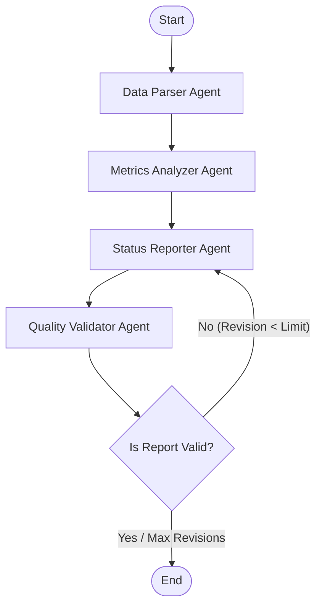

# AI Agent MVP Tracking Pipeline

A professional, modular, and production-ready multi-agent engineering tracker designed to analyze project activity (GitHub and Jira datasets), compute release metrics, and generate executive status reports.

Built with **Python 3.12**, **LangGraph**, and **Pydantic v2**, the system features a self-correction validation loop that cross-verifies metrics with LLM outputs to prevent hallucinations and ensure data accuracy.

---

## 🛠️ System Architecture

The pipeline is orchestrating four specialized agents using a **LangGraph StateGraph** workflow. 



### 1. Data Parser & Structuring Agent (Deterministic + Pydantic validation)
- Ingests raw GitHub activity and Jira ticket datasets.
- Parses data into strict Pydantic schemas, validating all types and inputs.
- Extracts linkages between code and tickets (e.g., commit messages matching Jira keys `MVP-\d+`).
- Calculates key baseline quantitative metrics (cycle times, completion rates, commit distributions, average PR turnaround).

### 2. Metrics & Progress Analyzer (LLM Agent)
- Receives structured data models and calculated metrics.
- Examines developer velocity, release timelines, code quality metrics, and development sprint risks.
- Generates a structured Product Management analysis mapping to the `AnalysisResult` Pydantic schema.

### 3. Status Reporter (LLM Agent)
- Synthesizes quantitative metrics and PM insights.
- Generates a comprehensive, publishable Markdown report including summary dashboards, development metric tables, and actionable next steps.

### 4. Quality Validator (LLM Agent)
- Performs automated Quality Assurance (QA).
- Cross-references the generated Markdown report against raw metrics and database values.
- Identifies inconsistencies or omissions (e.g., incorrect velocity values, ignored blockers).
- If validation fails, it generates correction feedback and routes the workflow back to the **Status Reporter** node. If valid, the workflow successfully concludes.

---

## 📁 Project Structure

```
mvp_tracker/
├── README.md                 # Project architecture and instructions
├── requirements.txt          # Python dependencies
├── main.py                   # CLI Runnable entrypoint
├── data/                     # Realistic activity data
│   ├── sample_github_data.json
│   └── sample_jira_data.json
├── src/                      # Source package
│   ├── config.py             # App configurations via pydantic-settings
│   ├── models/               # Pydantic schemas & state models
│   │   ├── raw_data.py       # GitHub and Jira data schemas
│   │   └── state.py          # Workflow state representation
│   ├── agents/               # Multi-agent implementations
│   │   ├── base.py           # Base agent configuration (OpenAI Client/Fallback)
│   │   ├── parser.py         # Data Parser & Metric calculation
│   │   ├── analyzer.py       # Metrics & Bottlenecks Analyzer Agent
│   │   ├── reporter.py       # Markdown Summary Reporter Agent
│   │   └── validator.py      # Automated QA Validator Agent
│   ├── workflow/             # Graph orchestration
│   │   └── graph.py          # LangGraph workflow compiled graph
│   └── utils/                # Helper utilities
│       └── logger.py         # Rich-styled logging setup
├── tests/                    # Test suite
│   ├── test_parser.py        # Data parsing unit tests
│   ├── test_analyzer.py      # PM analyzer unit tests
│   └── test_workflow.py      # End-to-end workflow and limit tests
└── sample_output/            # Generated executive reports
    └── report.md             # Output artifact from the pipeline
```

---

## 🚀 Getting Started

### 1. Installation & Environment Setup
Clone the repository and set up a Python virtual environment:

```bash
# Activate virtual environment
.\venv\Scripts\activate

# Install requirements
pip install -r requirements.txt
```

### 2. Configure Environment Variables
Create a `.env` file in the project root to use live OpenAI LLM execution:

```ini
OPENAI_API_KEY=your-api-key-here
```

### 3. Running the Pipeline
Execute the main script from the root directory:

```bash
# Run in Interactive Mode (prompts you for GitHub, Jira, and output paths)
python main.py

# Run in Direct CLI Mode (bypasses prompts, ideal for scripts/automation)
python main.py --github path/to/github.json --jira path/to/jira.json --output path/to/report.md
```

---

## 🧪 Testing

The repository comes equipped with automated unit and integration tests verifying individual agents and workflow behaviors (including validation loop counts).

To execute the tests:
```bash
python -m pytest tests
```

---

## 📄 Sample Output

When executed, the pipeline writes a beautifully formatted executive report to the designated output file (default: `sample_output/report.md`). 

The generated output covers:
- **Executive Summary Dashboard**
- **KPI Metrics Table** (Story points completed, velocity percent, lead times)
- **Developer Activity Charting**
- **Cycle Time & Timeline Risks**
- **Blockers & Bottlenecks** (Highlighted via markdown callout panels)
- **Actionable Recommendations**
